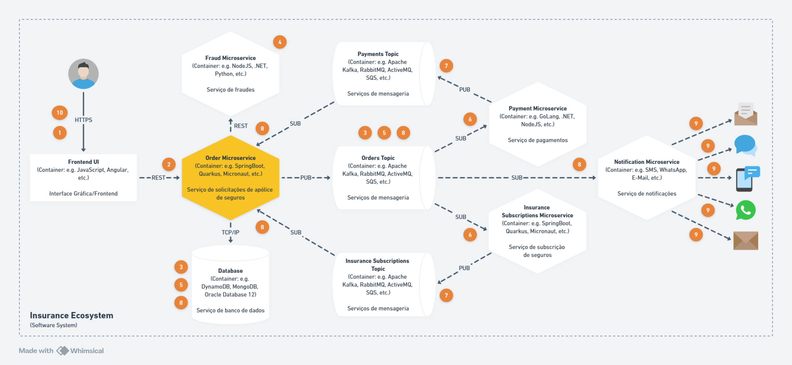
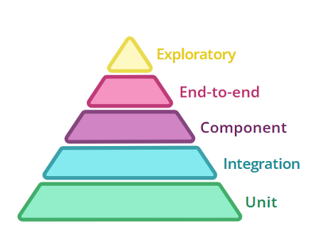
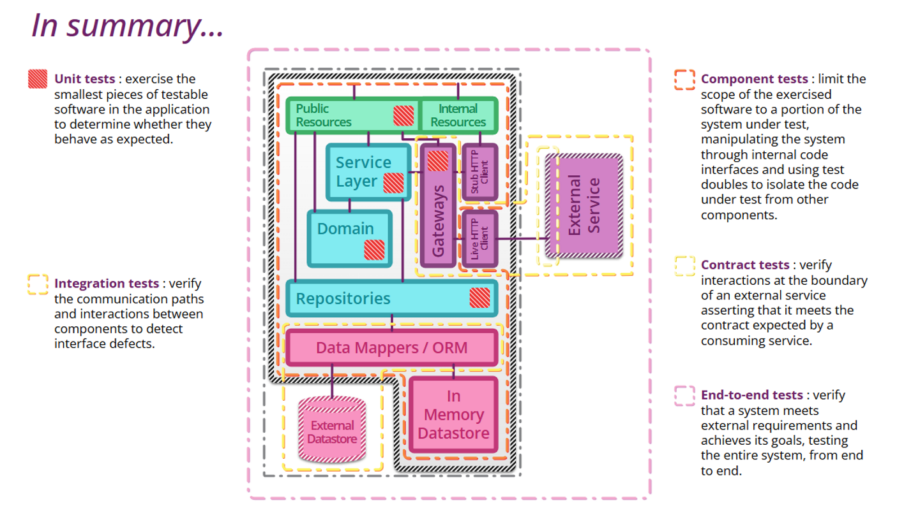

# DESAFIO ACME SEGURADORA

**Desafio Software Engineer**

## _Bem Vindo
Obrigado por participar do nosso processo! 😉

## _Preparando o Ambiente
Tecnologias necessárias para o desafio:
- JDK11 ou JDK17
- Docker ou Kubernetes
- Maven ou Gradle
- IntelliJ ou Eclipse (ou qualquer outra IDE de sua preferência)
- Postman ou Insomnia (ou qualquer outra ferramenta de sua preferência)

## _Cenário
A seguradora ACME deseja criar um microsserviço para gerenciar de forma eficaz seu processo de emissão de apólices de seguros.

Esse processo depende de eventos externos e deve ser capaz de realizar integrações com uma API de Fraudes, que será responsável por fornecer uma classificação de risco para o cliente na solicitação informada.

O ciclo de vida da solicitação será monitorado e controlado por estados específicos, e o serviço será responsável por gerenciar os eventos recebidos e garantir a consistência do fluxo.

## _Objetivo
Desenvolver um microsserviço com arquitetura orientada a eventos (**Event-Driven Architecture - EDA**) que gerencie o ciclo de vida das solicitações de apólice de seguros.

O sistema deve ser capaz de:

1. Receber solicitações de apólice de seguro através de uma **API REST**, persistir as informações em uma **base de dados** de **sua preferência** e retornar o ID da solicitação com data e hora da solicitação.
2. Processar as solicitações recebidas consultando a **API de Fraudes** para obter a **classificação de risco do cliente** na solicitação e aplicar **regras de validação** conforme o tipo de classificação de risco do cliente.
3. Permitir **consultas das solicitações** por ID da solicitação ou ID do cliente, através de uma **API REST**.
4. Receber e processar eventos relacionados ao **pagamento** e à **autorização de subscrição do seguro**, para posterior emissão da apólice.
5. Realizar o **cancelamento** da solicitação sempre que solicitado (**exceto em caso de emissão de apólice já realizada**).
6. Alterar o **estado da solicitação** conforme o ciclo de vida da mesma.
7. Publicar **eventos dos resultados de cada alteração de estado** para que os outros serviços recebam estímulos na cadeia de serviços de seguros e possam **notificar o cliente** à medida que sua solicitação **avança**.

- A **subscrição de seguros** é um processo interno realizado pela seguradora para **avaliar os riscos** de uma operação. O procedimento é adotado em todas as modalidades de seguros, por exemplo: seguro de carro até grandes seguros corporativos e empresariais.
- Cada evento da solicitação sensibiliza serviços diferentes, por exemplo: Pagamentos, Subscrição e Notificação.



**Legenda:**
1. Cliente realiza nova solicitação.
2. Frontend UI realiza integração REST com serviço de solicitações.
3. Serviço de solicitações persiste a solicitação, gera ID e publica atualização do estado **RECEBIDO** via mensageria.
4. Serviço de solicitações realiza integração REST com serviço de Fraudes e aplica regras.
5. Serviço de solicitações atualiza estado para **VALIDADO** ou **REJEITADO** e publica evento via mensageria.
6. Serviços de **pagamentos** e **subscrição** processam solicitação.
7. Serviços de **pagamentos** e **subscrição** publicam eventos do resultado do processamento.
8. Serviço de solicitações consome eventos de **pagamentos** e **subscrição** atualiza status de solicitação para **APROVADO** ou **REJEITADO** e publica evento via mensageria.
9. Serviço de notificações informa o cliente sobre o status da solicitação.
10. Cliente realiza consulta ou cancelamento da solicitação.

⚠️ **ATENÇÃO**: O escopo do desafio limita-se apenas ao serviço de solicitações de apólice.
Os demais serviços **NÃO** precisam ser desenvolvidos.

## _Ciclo de Vida da Solicitação de Apólice
O ciclo de vida da solicitação de apólice será composto pelos seguintes estados e transições:

1. **Recebido:** Quando uma solicitação é criada, ela inicia com estado **recebido** e só pode avançar para o estado **validado** ou **cancelado**. Neste momento, o sistema coleta as informações iniciais da solicitação e aguarda a análise pela **API de fraudes**, que validará a solicitação com base na avaliação de risco do cliente e determinará o perfil do cliente.
2. **Validado:** Após a consulta à **API de Fraudes**, deverão ser aplicadas regras de validação adicionais conforme a classificação do cliente e, caso sejam satisfeitas as condições, a solicitação passa para o estado **validado**, caso contrário **rejeitado**. A **API de fraudes** valida o risco da solicitação, classificação de risco do cliente e informações pertinentes, retornando uma classificação como **regular, alto risco, preferencial ou sem informação**.
3. **Pendente:** Após a validação, a solicitação deverá ficar com estado **pendente** até que ocorra a **confirmação de pagamento e a autorização da subscrição**.
Uma vez pendente, a solicitação só pode ter seu estado alterado para: **Aprovado, Rejeitado, Cancelado Ou pendente** novamente (casos de reprocessamento)
4. **Rejeitado:** Conforme a classificação do cliente, se não aplicar regras adicionais de validação ou as condições não forem satisfeitas, a solicitação deverá ter seu estado alterado para **rejeitado**, ou caso o pagamento seja negado ou a autorização de subscrição seja negada.
5. **Aprovado:** Após receber a confirmação de pagamento e a autorização de subscrição, o estado da solicitação deve ser alterado para **aprovado** e não poderá mais ser cancelada.
6. **Cancelada:** A qualquer momento, a solicitação pode ser **cancelada** por parte do cliente (exceto quando já aprovada ou rejeitada). Uma vez **cancelada**, a solicitação não deverá permitir novas alterações de estado, pois seu ciclo de vida terá sido encerrado.

## _Regras de Tipos de Cliente
A solicitação de apólice pode ser associada a diferentes tipos de clientes, e isso afeta a análise e critérios de validação:

🔸 **Cliente Regular:** Cliente com um perfil de risco baixo, com histórico comum e sem registros significativos de risco. A solicitação terá seu estado **alterado** para aprovada caso:
1. Capital segurado não ultrapasse `R$ 500.000,00` para **seguro de vida** ou **residencial**
2. Capital segurado não ultrapasse `R$ 350.000,00` para **seguro auto**
3. Capital segurado não ultrapasse `R$ 255.000,00` para qualquer **outro** tipo de seguro
4. Caso contrário, deverá ser **rejeitada**

🔸 **Cliente Alto Risco:** Cliente com perfil de maior risco, seja por comportamento, histórico recente ou problemas relacionados a sinistros. Neste caso, é necessário avaliar se:
1. Capital segurado não ultrapasse `R$ 250.000,00` para **seguro auto**
2. Capital segurado não ultrapasse `R$ 150.000,00` para **seguro residencial**
3. Capital segurado não ultrapasse `R$ 125.000,00` para qualquer **outro** tipo de seguro
4. Caso contrário, deverá ser **rejeitada**

🔸 **Cliente Preferencial:** Cliente com bom relacionamento com a seguradora, geralmente com menor risco associado. A solicitação terá limites maiores para aprovação conforme as seguintes regras:
1. Capital segurado inferior a `R$ 800.000,00` para **seguro vida**
2. Capital segurado inferior a `R$ 450.000,00` para **seguro auto** e **residencial**
3. Capital segurado não ultrapasse `R$ 375.000,00` para qualquer **outro** tipo de seguro
4. Caso contrário, deverá ser **rejeitada**

🔸 **Cliente Sem Informação:** Cliente sem histórico ou com pouco histórico com a seguradora. A solicitação será analisada com maior cautela, verificando se:
1. Capital segurado não ultrapasse `R$ 200.000,00` para **seguro de vida** ou **residencial**
2. Capital segurado não ultrapasse `R$ 75.000,00` para **seguro auto**
3. Capital segurado não ultrapasse `R$ 55.000,00` para qualquer **outro** tipo de seguro
4. Caso contrário, deverá ser **rejeitada**

## _Modelagem das APIs
Sua API de solicitações deverá conter pelo menos os seguintes campos:
- **Cliente ID:** ID do cliente em formato UUID (pode ser gerado randomicamente)
- **Produto ID:** ID do produto em formato numérico
- **Categoria:** Categoria do Seguro (Exemplo: Vida, Auto, Residencial, Empresarial etc.)
- Valor Total do prêmio mensal
- **Coberturas:** Lista de coberturas da solicitação de apólice
- **Assistências:** Lista de assistência da solicitação de apólice
- **Valor total do prêmio mensal:** É o valor mensal que o segurado paga à seguradora em troca das coberturas fornecidas
- **Valor do capital segurado:** É o valor máximo estipulado no contrato de seguro que a seguradora se compromete a pagar ao segurado ou beneficiários em caso de ocorrência do evento coberto pelo contrato
- **Forma de Pagamento:** Forma de Pagamento da Solicitação (Ex: Cartão de Crédito, Débito em Conta, Boleto, PIX)
- **Data/Hora Criação:** Data/Hora da criação da solicitação
- **Data/Hora Finalização:** Data/Hora da finalização da solicitação
- **Histórico:** Histórico das alterações de estado
- **Canal de Vendas:** Canal de vendas da solicitação (Ex: Mobile, WhatsApp, Web Site etc.)

📦 **Exemplo de request (solicitação):**

```bash
{
  "customer_id": "adc56d77-348c-4bf0-908f-22d40e2e715c",
  "product_id": "1b2da7cc-b367-4196-8a78-9cfeec21f587",
  "category": "AUTO",
  "salesChannel": "MOBILE",
  "paymentMethod": "CREDIT_CARD",
  "total_monthly_premium_amount": 75.25,
  "insured_amount": 275000.50,
  "coverages": {
    "Roubo": 100000.25,
    "Perda Total": 100000.25,
    "Colisão com Terceiros": 75000.00
  },
  "assistances": [
    "Guincho até 250km",
    "Troca de Óleo",
    "Chaveiro 24h"
  ]
}
```

Abaixo deixamos um exemplo de response da consulta da solicitação:

```bash
{
  "id": "89846ece-c6d5-4320-92e9-16e122d5c672",
  "customer_id": "adc56d77-348c-4bf0-908f-22d40e2e715c",
  "product_id": "1b2da7cc-b367-4196-8a78-9cfeec21f587",
  "category": "AUTO",
  "salesChannel": "MOBILE",
  "paymentMethod": "CREDIT_CARD",
  "status": "APPROVED", // APROVADO
  "createdAt": "2021-10-01T14:00:00Z", // Criado em
  "finishedAt": "2022-10-01T14:05:30Z", // Finalizado em
  "total_monthly_premium_amount": 75.25, // Valor total do prêmio mensal
  "insured_amount": 275000.50, // Valor do capital segurado
  "coverages": {
    "Roubo": 100000.25, // Cobertura por roubo
    "Perda Total": 100000.25, // Cobertura por perda total
    "Colisão com Terceiros": 75000.00 // Cobertura por colisão com terceiros
  },
  "assistances": [
    "Guincho até 250km", // Assistência: Guincho
    "Troca de Óleo",     // Assistência: Troca de óleo
    "Chaveiro 24h"       // Assistência: Chaveiro
  ],
  "history": [
    {
      "status": "RECEIVED", // RECEBIDO
      "timestamp": "2021-10-01T14:00:00Z"
    },
    {
      "status": "VALIDATED", // VALIDADO
      "timestamp": "2021-10-01T14:00:30Z"
    },
    {
      "status": "PENDING", // PENDENTE
      "timestamp": "2021-10-01T14:01:12Z"
    },
    {
      "status": "APPROVED", // APROVADO
      "timestamp": "2021-10-01T14:02:15Z"
    }
  ]
}
```

Você tem total liberdade de modelar as rotas da API REST de Fraudes que irá disponibilizar a classificação de risco do cliente para a solicitação desejada, mas considere que o retorno precisa ter os seguintes campos para que você possa aplicar as regras descritas acima:
- **Solicitação ID:** ID da solicitação de apólice de seguro (gerado no momento do recebimento).
- **Cliente ID:** ID do cliente da solicitação.
- **Data/Hora Análise:** Data/hora da análise.
- **Classificação:** Classificação de risco do cliente para a solicitação informada.
- **Ocorrências:** Histórico de ocorrência de suspeitas anteriores.

Abaixo deixamos um exemplo do response:

```bash
{
  "orderId": "e053467f-bd48-4fd2-9481-75bd4e88ee40",
  "customerId": "7c2a7ba7-1fef-4dd8-a3cf-5e094316ffd8",
  "analyzedAt": "2024-05-10T12:00:00Z",
  "classification": "HIGH_RISK",
  "occurrences": [
    {
      "id": "e053467f-bd48-4fd2-9481-75bd4e88ee40",
      "productId": 78900069,
      "type": "FRAUD",
      "description": "Attempted Fraudulent transaction",
      "createdAt": "2024-05-10T12:00:00Z",
      "updatedAt": "2024-05-10T12:00:00Z"
    },
    {
      "id": "f053467f-bd48-4fd2-9481-75bd4e88ee41",
      "productId": 104445569,
      "type": "SUSPICION",
      "description": "Unusual activity flagged for review",
      "createdAt": "2024-04-09T14:35:30Z",
      "updatedAt": "2024-04-09T14:35:30Z"
    }
  ]
}
```

**Observação:** Lembre-se de utilizar um **mock server** para definir as respostas, pois não é necessário desenvolver essa API.
Na próxima seção, serão indicados alguns brokers que podem ser utilizados para as comunicações com **mensageria** deste desafio.

## _Orientações Gerais
- Não é necessário desenvolver os serviços externos de API REST que serão consumidos no desafio. Utilize um **mock server**, como descrito anteriormente.
- Para o broker, sugerimos utilizar algum que permita o envio/recebimento de mensagens através de uma **interface gráfica** ou **CLI** (linha de comando), como funcionalidade provida pelo próprio broker.
- Crie um arquivo **docker-compose.yml** com toda a infraestrutura necessária para rodar seu desafio, tais como: **banco de dados**, **broker de mensageria**, **mock server** e **sua aplicação**.
- Não esqueça de documentar no **README.md** o método escolhido para interação com as mensagens, com exemplos de utilização para que seja possível reproduzir os testes que você realizou. 😊

Deixamos como alternativas os seguintes brokers de mensageria:
- Apache Kafka
- RabbitMQ
- ActiveMQ
- IBMMQ
- AWS SQS

Você pode escolher o broker com o qual se sentir mais confortável para o desafio, utilizando mensagens em formato **XML, JSON, Avro, Protobuf**, ou outro que preferir.

## _Pontos que daremos mais atenção
Abaixo os pontos que serão mais avaliados na entrega do desafio:
- Testes de unidade e integração
- Cobertura de testes (Code Coverage)
- Arquitetura utilizada
- Abstração, acoplamento, extensibilidade e coesão
- Profundidade na utilização de Design Patterns
- Clean Architecture
- Clean Code
- Princípios SOLID
- Documentação da Solução no README.md
- Observabilidade (métricas, traces e logs)

## _Pontos que não iremos avaliar
Abaixo os pontos que não serão avaliados (mas você pode incluir se desejar):
- Dockerfile
- Scripts de CI/CD
- Collections do Postman, Insomnia ou outra ferramenta para execução

## _Sobre a documentação
Nesta etapa do processo seletivo queremos entender as decisões por trás do código, portanto é fundamental que o README.md tenha algumas informações referentes à sua solução.

Algumas dicas do que esperamos ver são:
- Instruções básicas de como executar o projeto
- Detalhes sobre a solução — gostaríamos de saber qual foi o seu racional nas decisões
- Caso algo não esteja claro e você precisou assumir alguma premissa, quais foram e o que te motivou a tomar essas decisões

## _Como esperamos receber sua solução
Essa etapa é eliminatória, e por isso esperamos que o código reflita essa importância.

Se tiver algum imprevisto, dúvida ou problema, por favor entre em contato com a gente — estamos aqui para ajudar.

Atualmente trabalhamos com a stack Java/Spring, porém você pode utilizar a tecnologia de sua preferência.

Para candidatos externos: envie o link de um repositório público

Para candidatos internos: envie o projeto em formato .zip

## _Observações importantes
Não é necessário parametrizar os impostos em arquivos de configuração ou persistir em banco de dados.

Os campos a serem persistidos devem ser somente os informados no desafio.

## _Dicas
Aqui vão algumas dicas que podem ser úteis:

Como item opcional de leitura, deixamos este artigo rápido sobre testes:

Testing Strategies in a Microservice Architecture

https://martinfowler.com/articles/microservice-testing/#conclusion-test-pyramid

Nele é possível ver a diferença entre os principais tipos de teste.



